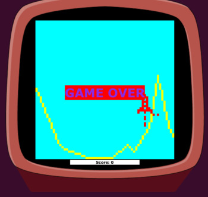
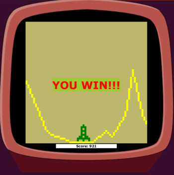

# MoonLander🚀
Игра, так же известная как "Лунный модуль".
Мы создадим симпатичный посадочный модуль, 
который нужно аккуратно посадить на Луну, не задев горы. 
Для мягкой и ровной посадки будем использовать  основной двигатель, 
который замедляет падение и приподнимает, 
а также боковые двигатели для горизонтального перемещения. 
От скорости посадки корабля зависит количество заработанных очков.

## Control 🕹

Управление аппаратом происходит стрелками клавиатуры.
 Space возобнавляет игру.
 Для выхода из игры нажмите Esc. 

## Setup

Скачайте папку target со всем содержимым.
Запустите скрипт и вперёд, покарять аркаду😎

`cd <path-to-target>`
 
`sh runMoonLander.sh`

## ScreenShots

