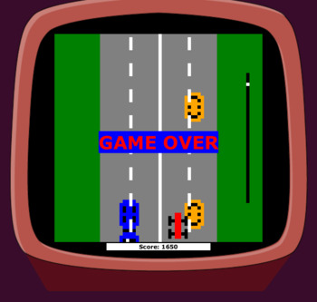
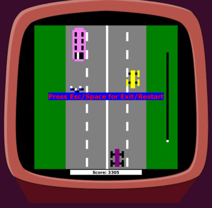

# Racer 🏎

Любимый жанр миллионов. Цель — добраться до финишной линии, не врезавшись ни в один из этих объектов.
  Финишная черта появится через какое-то определённое количество препятствий.
## Control 🕹

Управление машиной осуществляется стрелками
 Space возобнавляет игру.
 Для выхода из игры нажмите Esc. 

## Setup

Скачайте папку target со всем содержимым.
Запустите скрипт и наслаждайтесь игрой

`cd <path-to-target>`
 
`sh runRacer.sh`

## ScreenShots

