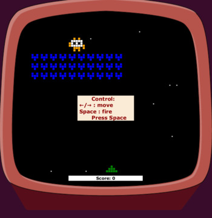
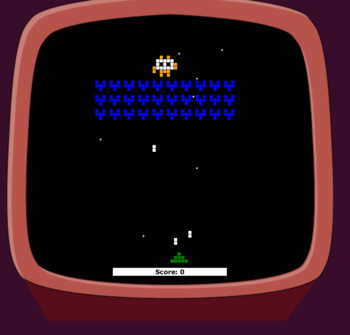

# Space Invaders👾

Космический сеттинг с симпатичной графикой а-ля 8 бит, стрельба по агрессивным захватчикам, рядовым и «генералам», которые прячутся за их спинами.
Игроку предстоит сражаться до тех пор, пока он не убьет всех рядовых и босса. Или пока его не сразит инопланетная пуля.

## Control 🕹

Управление стрелками ← →
 Space произвести выстрел или рестарт игры.
 Остановить игру можно с помощью Esc, 
для выхода из игры ещё раз нажмите Esc. 

## Setup 

Скачайте папку target со всем содержимым.
Земляне верят в вас! ⚔

`cd <path-to-target>`
 
`sh runSpaceInvaders.sh`

## ScreenShots

